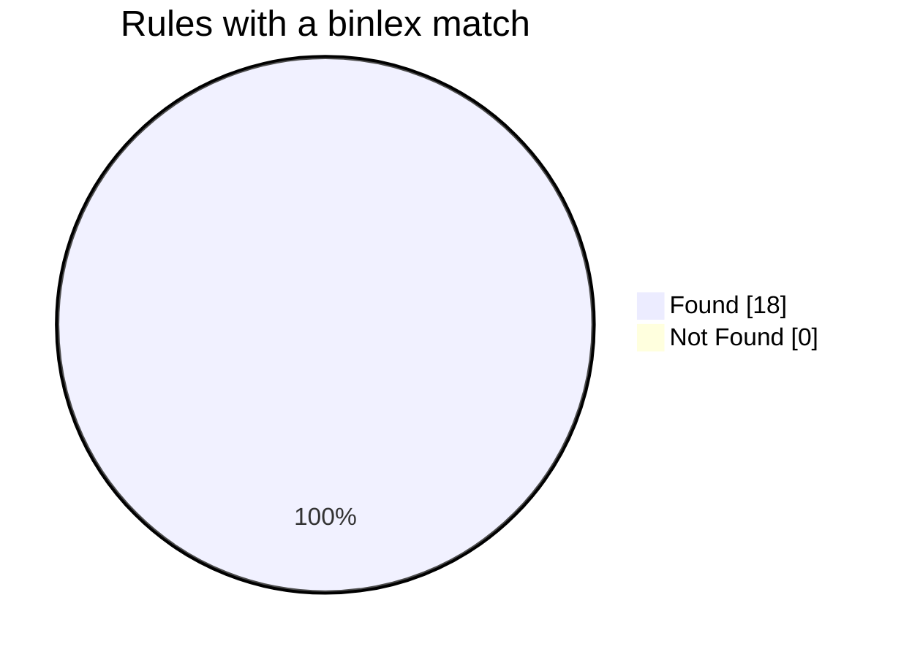
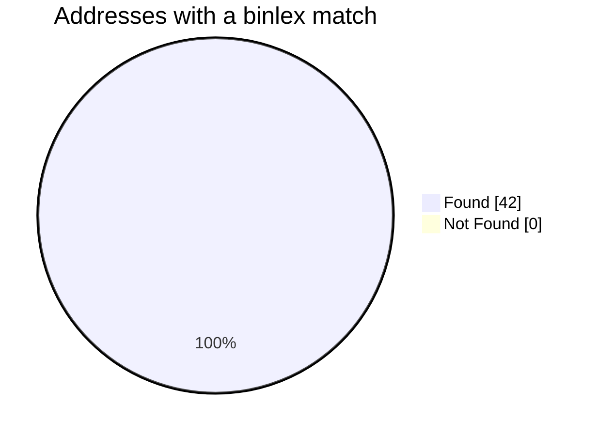
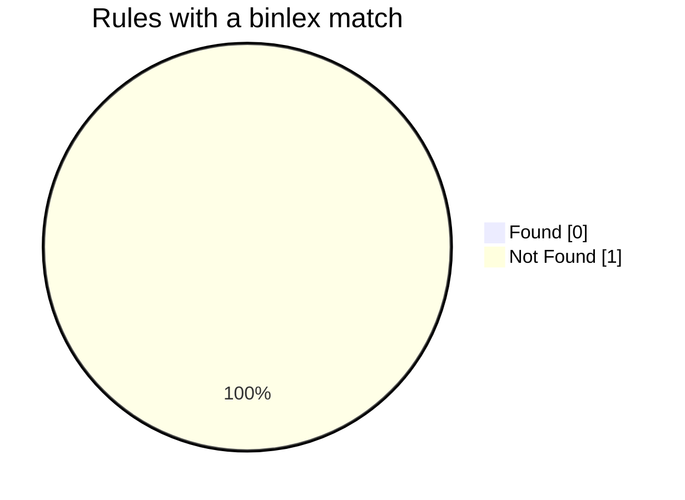
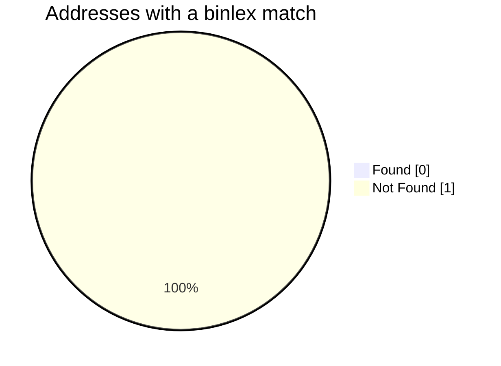

# Meta information
File path: A:\malware.exe
Format: PE
Architecture: i386
MD5: 5b3829a65c81d4e96fe169b3c789b143
SHA1: (unknown)
SHA256: 2d66d000874a77e4c81f5ab34674fbc0bf5e28aac86ce07e5fd99aee1b84d244
CAPA rules used: A:\rules
FLIRT signatures used: A:\flirt\windows
# Results for functions

<table border="1">
    <tr>
        <th rowspan="3">Rule name</th>
        <th rowspan="3">Address</th>
        <th colspan="12">Binlex results</th>
    </tr>
    <tr>
        <th rowspan="2">Name of the function</th>
        <th rowspan="2">SHA256 of the sample</th>
        <th rowspan="2">Address in the sample</th>
        <th colspan="5">Obfuscation statistic</th>
        <th colspan="4">Comparison scores</th>
    </tr>
    <tr>
        <th>Cyclomatic complexity</th>
        <th>Number of instructions</th>
        <th>Entropy</th>
        <th>Average instructions per block</th>
        <th>Size</th>
        <th>GNN</th>
        <th>Minhash</th>
        <th>Combined</th>
        <th>Size</th>
    </tr>
    <tr>
        <td>resolve function by parsing PE exports</td>
        <td>0x40a8b3</td>
        <td style="background: hsl(120, 100.0%, 60%);">?GetExportAddress@@YIP6GHXZPAUHINSTANCE__@@PBD@Z</td>
        <td style="background: hsl(120, 100.0%, 60%);">2d66d000874a77e4c81f5ab34674fbc0bf5e28aac86ce07e5fd99aee1b84d244</td>
        <td style="background: hsl(120, 100.0%, 60%);">4237491</td>
        <td style="background: hsl(120, 100.0%, 60%);">5</td>
        <td style="background: hsl(120, 100.0%, 60%);">79</td>
        <td style="background: hsl(120, 100.0%, 60%);">2.97</td>
        <td style="background: hsl(120, 100.0%, 60%);">5.64</td>
        <td style="background: hsl(120, 100.0%, 60%);">200</td>
        <td style="background: hsl(120, 100.0%, 60%);">1.00</td>
        <td style="background: hsl(120, 100.0%, 60%);">1.00</td>
        <td style="background: hsl(120, 100.0%, 60%);">1.00</td>
        <td style="background: hsl(120, 100.0%, 60%);">1.00</td>
    </tr>
    <tr>
        <td rowspan=8>query environment variable</td>
        <td>0x40af34</td>
        <td style="background: hsl(120, 100.0%, 60%);">??0Stealing@@QAE@ABV?$basic_string@DU?$char_traits@D@std@@V?$allocator@D@2@@std@@00000@Z</td>
        <td style="background: hsl(120, 100.0%, 60%);">2d66d000874a77e4c81f5ab34674fbc0bf5e28aac86ce07e5fd99aee1b84d244</td>
        <td style="background: hsl(120, 100.0%, 60%);">4239156</td>
        <td style="background: hsl(120, 100.0%, 60%);">2</td>
        <td style="background: hsl(120, 100.0%, 60%);">180</td>
        <td style="background: hsl(120, 100.0%, 60%);">5.31</td>
        <td style="background: hsl(120, 100.0%, 60%);">180.00</td>
        <td style="background: hsl(120, 100.0%, 60%);">537</td>
        <td style="background: hsl(120, 100.0%, 60%);">1.00</td>
        <td style="background: hsl(120, 100.0%, 60%);">1.00</td>
        <td style="background: hsl(120, 100.0%, 60%);">1.00</td>
        <td style="background: hsl(120, 100.0%, 60%);">1.00</td>
    </tr>
    <tr>
        <td>0x40b882</td>
        <td style="background: hsl(120, 100.0%, 60%);">_WinMain@16</td>
        <td style="background: hsl(120, 100.0%, 60%);">2d66d000874a77e4c81f5ab34674fbc0bf5e28aac86ce07e5fd99aee1b84d244</td>
        <td style="background: hsl(120, 100.0%, 60%);">4241538</td>
        <td style="background: hsl(120, 100.0%, 60%);">0</td>
        <td style="background: hsl(120, 100.0%, 60%);">34</td>
        <td style="background: hsl(120, 100.0%, 60%);">3.52</td>
        <td style="background: hsl(120, 100.0%, 60%);">11.33</td>
        <td style="background: hsl(120, 100.0%, 60%);">90</td>
        <td style="background: hsl(120, 100.0%, 60%);">1.00</td>
        <td style="background: hsl(120, 100.0%, 60%);">1.00</td>
        <td style="background: hsl(120, 100.0%, 60%);">1.00</td>
        <td style="background: hsl(120, 100.0%, 60%);">1.00</td>
    </tr>
    <tr>
        <td>0x40d251</td>
        <td style="background: hsl(120, 100.0%, 60%);">?getUserName@file@@QAE?AV?$basic_string@DU?$char_traits@D@std@@V?$allocator@D@2@@std@@XZ</td>
        <td style="background: hsl(120, 100.0%, 60%);">2d66d000874a77e4c81f5ab34674fbc0bf5e28aac86ce07e5fd99aee1b84d244</td>
        <td style="background: hsl(120, 100.0%, 60%);">4248145</td>
        <td style="background: hsl(120, 100.0%, 60%);">2</td>
        <td style="background: hsl(120, 100.0%, 60%);">22</td>
        <td style="background: hsl(120, 100.0%, 60%);">4.89</td>
        <td style="background: hsl(120, 100.0%, 60%);">5.50</td>
        <td style="background: hsl(120, 100.0%, 60%);">51</td>
        <td style="background: hsl(120, 100.0%, 60%);">1.00</td>
        <td style="background: hsl(120, 100.0%, 60%);">1.00</td>
        <td style="background: hsl(120, 100.0%, 60%);">1.00</td>
        <td style="background: hsl(120, 100.0%, 60%);">1.00</td>
    </tr>
    <tr>
        <td>0x410fe8</td>
        <td style="background: hsl(120, 100.0%, 60%);">?GetWallets@Stealing@@QAEXABV?$basic_string@DU?$char_traits@D@std@@V?$allocator@D@2@@std@@@Z</td>
        <td style="background: hsl(120, 100.0%, 60%);">2d66d000874a77e4c81f5ab34674fbc0bf5e28aac86ce07e5fd99aee1b84d244</td>
        <td style="background: hsl(120, 100.0%, 60%);">4263912</td>
        <td style="background: hsl(120, 100.0%, 60%);">4</td>
        <td style="background: hsl(120, 100.0%, 60%);">183</td>
        <td style="background: hsl(120, 100.0%, 60%);">5.29</td>
        <td style="background: hsl(120, 100.0%, 60%);">22.88</td>
        <td style="background: hsl(120, 100.0%, 60%);">567</td>
        <td style="background: hsl(120, 100.0%, 60%);">1.00</td>
        <td style="background: hsl(120, 100.0%, 60%);">1.00</td>
        <td style="background: hsl(120, 100.0%, 60%);">1.00</td>
        <td style="background: hsl(120, 100.0%, 60%);">1.00</td>
    </tr>
    <tr>
        <td>0x41121f</td>
        <td style="background: hsl(120, 100.0%, 60%);">?GetFiles@Stealing@@QAEXABV?$basic_string@DU?$char_traits@D@std@@V?$allocator@D@2@@std@@@Z</td>
        <td style="background: hsl(120, 100.0%, 60%);">2d66d000874a77e4c81f5ab34674fbc0bf5e28aac86ce07e5fd99aee1b84d244</td>
        <td style="background: hsl(120, 100.0%, 60%);">4264479</td>
        <td style="background: hsl(120, 100.0%, 60%);">0</td>
        <td style="background: hsl(120, 100.0%, 60%);">9</td>
        <td style="background: hsl(120, 100.0%, 60%);">4.17</td>
        <td style="background: hsl(120, 100.0%, 60%);">9.00</td>
        <td style="background: hsl(120, 100.0%, 60%);">24</td>
        <td style="background: hsl(120, 100.0%, 60%);">1.00</td>
        <td style="background: hsl(120, 100.0%, 60%);">1.00</td>
        <td style="background: hsl(120, 100.0%, 60%);">1.00</td>
        <td style="background: hsl(120, 100.0%, 60%);">1.00</td>
    </tr>
    <tr>
        <td>0x4119ce</td>
        <td style="background: hsl(120, 100.0%, 60%);">?GetTelegram@Stealing@@QAEXABV?$basic_string@DU?$char_traits@D@std@@V?$allocator@D@2@@std@@@Z</td>
        <td style="background: hsl(120, 100.0%, 60%);">2d66d000874a77e4c81f5ab34674fbc0bf5e28aac86ce07e5fd99aee1b84d244</td>
        <td style="background: hsl(120, 100.0%, 60%);">4266446</td>
        <td style="background: hsl(120, 100.0%, 60%);">0</td>
        <td style="background: hsl(120, 100.0%, 60%);">9</td>
        <td style="background: hsl(120, 100.0%, 60%);">4.25</td>
        <td style="background: hsl(120, 100.0%, 60%);">9.00</td>
        <td style="background: hsl(120, 100.0%, 60%);">24</td>
        <td style="background: hsl(120, 100.0%, 60%);">1.00</td>
        <td style="background: hsl(120, 100.0%, 60%);">1.00</td>
        <td style="background: hsl(120, 100.0%, 60%);">1.00</td>
        <td style="background: hsl(120, 100.0%, 60%);">1.00</td>
    </tr>
    <tr>
        <td>0x411c04</td>
        <td style="background: hsl(120, 100.0%, 60%);">?GetDiscord@Stealing@@QAEXABV?$basic_string@DU?$char_traits@D@std@@V?$allocator@D@2@@std@@@Z</td>
        <td style="background: hsl(120, 100.0%, 60%);">2d66d000874a77e4c81f5ab34674fbc0bf5e28aac86ce07e5fd99aee1b84d244</td>
        <td style="background: hsl(120, 100.0%, 60%);">4267012</td>
        <td style="background: hsl(120, 100.0%, 60%);">0</td>
        <td style="background: hsl(120, 100.0%, 60%);">10</td>
        <td style="background: hsl(120, 100.0%, 60%);">4.39</td>
        <td style="background: hsl(120, 100.0%, 60%);">10.00</td>
        <td style="background: hsl(120, 100.0%, 60%);">26</td>
        <td style="background: hsl(120, 100.0%, 60%);">1.00</td>
        <td style="background: hsl(120, 100.0%, 60%);">1.00</td>
        <td style="background: hsl(120, 100.0%, 60%);">1.00</td>
        <td style="background: hsl(120, 100.0%, 60%);">1.00</td>
    </tr>
    <tr>
        <td>0x411d02</td>
        <td style="background: hsl(120, 100.0%, 60%);">?GetInformation@Stealing@@QAEXABV?$basic_string@DU?$char_traits@D@std@@V?$allocator@D@2@@std@@ABV?$time_point@Usystem_clock@chrono@std@@V?$duration@_JU?$ratio@$00$0JIJGIA@@std@@@23@@chrono@3@0K@Z</td>
        <td style="background: hsl(120, 100.0%, 60%);">2d66d000874a77e4c81f5ab34674fbc0bf5e28aac86ce07e5fd99aee1b84d244</td>
        <td style="background: hsl(120, 100.0%, 60%);">4267266</td>
        <td style="background: hsl(120, 100.0%, 60%);">0</td>
        <td style="background: hsl(120, 100.0%, 60%);">12</td>
        <td style="background: hsl(120, 100.0%, 60%);">4.39</td>
        <td style="background: hsl(120, 100.0%, 60%);">12.00</td>
        <td style="background: hsl(120, 100.0%, 60%);">31</td>
        <td style="background: hsl(120, 100.0%, 60%);">1.00</td>
        <td style="background: hsl(120, 100.0%, 60%);">1.00</td>
        <td style="background: hsl(120, 100.0%, 60%);">1.00</td>
        <td style="background: hsl(120, 100.0%, 60%);">1.00</td>
    </tr>
    <tr>
        <td rowspan=3>read file on Windows</td>
        <td>0x40d284</td>
        <td style="background: hsl(120, 100.0%, 60%);">?ReadAllBytes@SqlHandler@@AAE_NAAV?$vector@EV?$allocator@E@std@@@std@@ABV?$basic_string@DU?$char_traits@D@std@@V?$allocator@D@2@@3@@Z</td>
        <td style="background: hsl(120, 100.0%, 60%);">2d66d000874a77e4c81f5ab34674fbc0bf5e28aac86ce07e5fd99aee1b84d244</td>
        <td style="background: hsl(120, 100.0%, 60%);">4248196</td>
        <td style="background: hsl(120, 100.0%, 60%);">2</td>
        <td style="background: hsl(120, 100.0%, 60%);">59</td>
        <td style="background: hsl(120, 100.0%, 60%);">2.91</td>
        <td style="background: hsl(120, 100.0%, 60%);">7.38</td>
        <td style="background: hsl(120, 100.0%, 60%);">126</td>
        <td style="background: hsl(120, 100.0%, 60%);">1.00</td>
        <td style="background: hsl(120, 100.0%, 60%);">1.00</td>
        <td style="background: hsl(120, 100.0%, 60%);">1.00</td>
        <td style="background: hsl(120, 100.0%, 60%);">1.00</td>
    </tr>
    <tr>
        <td>0x40e5c9</td>
        <td style="background: hsl(120, 100.0%, 60%);">?urlWriteFile@Stealing@@AAE_NABV?$basic_string@DU?$char_traits@D@std@@V?$allocator@D@2@@std@@0K00@Z</td>
        <td style="background: hsl(120, 100.0%, 60%);">2d66d000874a77e4c81f5ab34674fbc0bf5e28aac86ce07e5fd99aee1b84d244</td>
        <td style="background: hsl(120, 100.0%, 60%);">4253129</td>
        <td style="background: hsl(120, 100.0%, 60%);">4</td>
        <td style="background: hsl(120, 100.0%, 60%);">210</td>
        <td style="background: hsl(120, 100.0%, 60%);">5.81</td>
        <td style="background: hsl(120, 100.0%, 60%);">14.00</td>
        <td style="background: hsl(120, 100.0%, 60%);">645</td>
        <td style="background: hsl(120, 100.0%, 60%);">1.00</td>
        <td style="background: hsl(120, 100.0%, 60%);">1.00</td>
        <td style="background: hsl(120, 100.0%, 60%);">1.00</td>
        <td style="background: hsl(120, 100.0%, 60%);">1.00</td>
    </tr>
    <tr>
        <td>0x40ec9b</td>
        <td style="background: hsl(120, 100.0%, 60%);">?SteamHelper@Stealing@@AAEXABV?$basic_string@DU?$char_traits@D@std@@V?$allocator@D@2@@std@@0@Z</td>
        <td style="background: hsl(120, 100.0%, 60%);">2d66d000874a77e4c81f5ab34674fbc0bf5e28aac86ce07e5fd99aee1b84d244</td>
        <td style="background: hsl(120, 100.0%, 60%);">4254875</td>
        <td style="background: hsl(120, 100.0%, 60%);">0</td>
        <td style="background: hsl(120, 100.0%, 60%);">8</td>
        <td style="background: hsl(120, 100.0%, 60%);">4.10</td>
        <td style="background: hsl(120, 100.0%, 60%);">8.00</td>
        <td style="background: hsl(120, 100.0%, 60%);">22</td>
        <td style="background: hsl(120, 100.0%, 60%);">1.00</td>
        <td style="background: hsl(120, 100.0%, 60%);">1.00</td>
        <td style="background: hsl(120, 100.0%, 60%);">1.00</td>
        <td style="background: hsl(120, 100.0%, 60%);">1.00</td>
    </tr>
    <tr>
        <td>write file on Windows</td>
        <td>0x40e1bf</td>
        <td style="background: hsl(120, 100.0%, 60%);">?WriteAllText@Stealing@@QAEXABV?$basic_string@DU?$char_traits@D@std@@V?$allocator@D@2@@std@@00@Z</td>
        <td style="background: hsl(120, 100.0%, 60%);">2d66d000874a77e4c81f5ab34674fbc0bf5e28aac86ce07e5fd99aee1b84d244</td>
        <td style="background: hsl(120, 100.0%, 60%);">4252095</td>
        <td style="background: hsl(120, 100.0%, 60%);">0</td>
        <td style="background: hsl(120, 100.0%, 60%);">8</td>
        <td style="background: hsl(120, 100.0%, 60%);">3.97</td>
        <td style="background: hsl(120, 100.0%, 60%);">8.00</td>
        <td style="background: hsl(120, 100.0%, 60%);">17</td>
        <td style="background: hsl(120, 100.0%, 60%);">1.00</td>
        <td style="background: hsl(120, 100.0%, 60%);">1.00</td>
        <td style="background: hsl(120, 100.0%, 60%);">1.00</td>
        <td style="background: hsl(120, 100.0%, 60%);">1.00</td>
    </tr>
    <tr>
        <td rowspan=3>send HTTP request</td>
        <td>0x40e5c9</td>
        <td style="background: hsl(120, 100.0%, 60%);">?urlWriteFile@Stealing@@AAE_NABV?$basic_string@DU?$char_traits@D@std@@V?$allocator@D@2@@std@@0K00@Z</td>
        <td style="background: hsl(120, 100.0%, 60%);">2d66d000874a77e4c81f5ab34674fbc0bf5e28aac86ce07e5fd99aee1b84d244</td>
        <td style="background: hsl(120, 100.0%, 60%);">4253129</td>
        <td style="background: hsl(120, 100.0%, 60%);">4</td>
        <td style="background: hsl(120, 100.0%, 60%);">210</td>
        <td style="background: hsl(120, 100.0%, 60%);">5.81</td>
        <td style="background: hsl(120, 100.0%, 60%);">14.00</td>
        <td style="background: hsl(120, 100.0%, 60%);">645</td>
        <td style="background: hsl(120, 100.0%, 60%);">1.00</td>
        <td style="background: hsl(120, 100.0%, 60%);">1.00</td>
        <td style="background: hsl(120, 100.0%, 60%);">1.00</td>
        <td style="background: hsl(120, 100.0%, 60%);">1.00</td>
    </tr>
    <tr>
        <td>0x411d02</td>
        <td style="background: hsl(120, 100.0%, 60%);">?GetInformation@Stealing@@QAEXABV?$basic_string@DU?$char_traits@D@std@@V?$allocator@D@2@@std@@ABV?$time_point@Usystem_clock@chrono@std@@V?$duration@_JU?$ratio@$00$0JIJGIA@@std@@@23@@chrono@3@0K@Z</td>
        <td style="background: hsl(120, 100.0%, 60%);">2d66d000874a77e4c81f5ab34674fbc0bf5e28aac86ce07e5fd99aee1b84d244</td>
        <td style="background: hsl(120, 100.0%, 60%);">4267266</td>
        <td style="background: hsl(120, 100.0%, 60%);">0</td>
        <td style="background: hsl(120, 100.0%, 60%);">12</td>
        <td style="background: hsl(120, 100.0%, 60%);">4.39</td>
        <td style="background: hsl(120, 100.0%, 60%);">12.00</td>
        <td style="background: hsl(120, 100.0%, 60%);">31</td>
        <td style="background: hsl(120, 100.0%, 60%);">1.00</td>
        <td style="background: hsl(120, 100.0%, 60%);">1.00</td>
        <td style="background: hsl(120, 100.0%, 60%);">1.00</td>
        <td style="background: hsl(120, 100.0%, 60%);">1.00</td>
    </tr>
    <tr>
        <td>0x413e7a</td>
        <td style="background: hsl(120, 100.0%, 60%);">?GetExecuteFile@Stealing@@QAEXABV?$basic_string@DU?$char_traits@D@std@@V?$allocator@D@2@@std@@0K@Z</td>
        <td style="background: hsl(120, 100.0%, 60%);">2d66d000874a77e4c81f5ab34674fbc0bf5e28aac86ce07e5fd99aee1b84d244</td>
        <td style="background: hsl(120, 100.0%, 60%);">4275834</td>
        <td style="background: hsl(120, 100.0%, 60%);">0</td>
        <td style="background: hsl(120, 100.0%, 60%);">9</td>
        <td style="background: hsl(120, 100.0%, 60%);">4.25</td>
        <td style="background: hsl(120, 100.0%, 60%);">9.00</td>
        <td style="background: hsl(120, 100.0%, 60%);">24</td>
        <td style="background: hsl(120, 100.0%, 60%);">1.00</td>
        <td style="background: hsl(120, 100.0%, 60%);">1.00</td>
        <td style="background: hsl(120, 100.0%, 60%);">1.00</td>
        <td style="background: hsl(120, 100.0%, 60%);">1.00</td>
    </tr>
    <tr>
        <td rowspan=3>create HTTP request</td>
        <td>0x40e5c9</td>
        <td style="background: hsl(120, 100.0%, 60%);">?urlWriteFile@Stealing@@AAE_NABV?$basic_string@DU?$char_traits@D@std@@V?$allocator@D@2@@std@@0K00@Z</td>
        <td style="background: hsl(120, 100.0%, 60%);">2d66d000874a77e4c81f5ab34674fbc0bf5e28aac86ce07e5fd99aee1b84d244</td>
        <td style="background: hsl(120, 100.0%, 60%);">4253129</td>
        <td style="background: hsl(120, 100.0%, 60%);">4</td>
        <td style="background: hsl(120, 100.0%, 60%);">210</td>
        <td style="background: hsl(120, 100.0%, 60%);">5.81</td>
        <td style="background: hsl(120, 100.0%, 60%);">14.00</td>
        <td style="background: hsl(120, 100.0%, 60%);">645</td>
        <td style="background: hsl(120, 100.0%, 60%);">1.00</td>
        <td style="background: hsl(120, 100.0%, 60%);">1.00</td>
        <td style="background: hsl(120, 100.0%, 60%);">1.00</td>
        <td style="background: hsl(120, 100.0%, 60%);">1.00</td>
    </tr>
    <tr>
        <td>0x411d02</td>
        <td style="background: hsl(120, 100.0%, 60%);">?GetInformation@Stealing@@QAEXABV?$basic_string@DU?$char_traits@D@std@@V?$allocator@D@2@@std@@ABV?$time_point@Usystem_clock@chrono@std@@V?$duration@_JU?$ratio@$00$0JIJGIA@@std@@@23@@chrono@3@0K@Z</td>
        <td style="background: hsl(120, 100.0%, 60%);">2d66d000874a77e4c81f5ab34674fbc0bf5e28aac86ce07e5fd99aee1b84d244</td>
        <td style="background: hsl(120, 100.0%, 60%);">4267266</td>
        <td style="background: hsl(120, 100.0%, 60%);">0</td>
        <td style="background: hsl(120, 100.0%, 60%);">12</td>
        <td style="background: hsl(120, 100.0%, 60%);">4.39</td>
        <td style="background: hsl(120, 100.0%, 60%);">12.00</td>
        <td style="background: hsl(120, 100.0%, 60%);">31</td>
        <td style="background: hsl(120, 100.0%, 60%);">1.00</td>
        <td style="background: hsl(120, 100.0%, 60%);">1.00</td>
        <td style="background: hsl(120, 100.0%, 60%);">1.00</td>
        <td style="background: hsl(120, 100.0%, 60%);">1.00</td>
    </tr>
    <tr>
        <td>0x413e7a</td>
        <td style="background: hsl(120, 100.0%, 60%);">?GetExecuteFile@Stealing@@QAEXABV?$basic_string@DU?$char_traits@D@std@@V?$allocator@D@2@@std@@0K@Z</td>
        <td style="background: hsl(120, 100.0%, 60%);">2d66d000874a77e4c81f5ab34674fbc0bf5e28aac86ce07e5fd99aee1b84d244</td>
        <td style="background: hsl(120, 100.0%, 60%);">4275834</td>
        <td style="background: hsl(120, 100.0%, 60%);">0</td>
        <td style="background: hsl(120, 100.0%, 60%);">9</td>
        <td style="background: hsl(120, 100.0%, 60%);">4.25</td>
        <td style="background: hsl(120, 100.0%, 60%);">9.00</td>
        <td style="background: hsl(120, 100.0%, 60%);">24</td>
        <td style="background: hsl(120, 100.0%, 60%);">1.00</td>
        <td style="background: hsl(120, 100.0%, 60%);">1.00</td>
        <td style="background: hsl(120, 100.0%, 60%);">1.00</td>
        <td style="background: hsl(120, 100.0%, 60%);">1.00</td>
    </tr>
    <tr>
        <td rowspan=3>connect to HTTP server</td>
        <td>0x40e5c9</td>
        <td style="background: hsl(120, 100.0%, 60%);">?urlWriteFile@Stealing@@AAE_NABV?$basic_string@DU?$char_traits@D@std@@V?$allocator@D@2@@std@@0K00@Z</td>
        <td style="background: hsl(120, 100.0%, 60%);">2d66d000874a77e4c81f5ab34674fbc0bf5e28aac86ce07e5fd99aee1b84d244</td>
        <td style="background: hsl(120, 100.0%, 60%);">4253129</td>
        <td style="background: hsl(120, 100.0%, 60%);">4</td>
        <td style="background: hsl(120, 100.0%, 60%);">210</td>
        <td style="background: hsl(120, 100.0%, 60%);">5.81</td>
        <td style="background: hsl(120, 100.0%, 60%);">14.00</td>
        <td style="background: hsl(120, 100.0%, 60%);">645</td>
        <td style="background: hsl(120, 100.0%, 60%);">1.00</td>
        <td style="background: hsl(120, 100.0%, 60%);">1.00</td>
        <td style="background: hsl(120, 100.0%, 60%);">1.00</td>
        <td style="background: hsl(120, 100.0%, 60%);">1.00</td>
    </tr>
    <tr>
        <td>0x411d02</td>
        <td style="background: hsl(120, 100.0%, 60%);">?GetInformation@Stealing@@QAEXABV?$basic_string@DU?$char_traits@D@std@@V?$allocator@D@2@@std@@ABV?$time_point@Usystem_clock@chrono@std@@V?$duration@_JU?$ratio@$00$0JIJGIA@@std@@@23@@chrono@3@0K@Z</td>
        <td style="background: hsl(120, 100.0%, 60%);">2d66d000874a77e4c81f5ab34674fbc0bf5e28aac86ce07e5fd99aee1b84d244</td>
        <td style="background: hsl(120, 100.0%, 60%);">4267266</td>
        <td style="background: hsl(120, 100.0%, 60%);">0</td>
        <td style="background: hsl(120, 100.0%, 60%);">12</td>
        <td style="background: hsl(120, 100.0%, 60%);">4.39</td>
        <td style="background: hsl(120, 100.0%, 60%);">12.00</td>
        <td style="background: hsl(120, 100.0%, 60%);">31</td>
        <td style="background: hsl(120, 100.0%, 60%);">1.00</td>
        <td style="background: hsl(120, 100.0%, 60%);">1.00</td>
        <td style="background: hsl(120, 100.0%, 60%);">1.00</td>
        <td style="background: hsl(120, 100.0%, 60%);">1.00</td>
    </tr>
    <tr>
        <td>0x413e7a</td>
        <td style="background: hsl(120, 100.0%, 60%);">?GetExecuteFile@Stealing@@QAEXABV?$basic_string@DU?$char_traits@D@std@@V?$allocator@D@2@@std@@0K@Z</td>
        <td style="background: hsl(120, 100.0%, 60%);">2d66d000874a77e4c81f5ab34674fbc0bf5e28aac86ce07e5fd99aee1b84d244</td>
        <td style="background: hsl(120, 100.0%, 60%);">4275834</td>
        <td style="background: hsl(120, 100.0%, 60%);">0</td>
        <td style="background: hsl(120, 100.0%, 60%);">9</td>
        <td style="background: hsl(120, 100.0%, 60%);">4.25</td>
        <td style="background: hsl(120, 100.0%, 60%);">9.00</td>
        <td style="background: hsl(120, 100.0%, 60%);">24</td>
        <td style="background: hsl(120, 100.0%, 60%);">1.00</td>
        <td style="background: hsl(120, 100.0%, 60%);">1.00</td>
        <td style="background: hsl(120, 100.0%, 60%);">1.00</td>
        <td style="background: hsl(120, 100.0%, 60%);">1.00</td>
    </tr>
    <tr>
        <td rowspan=3>reference HTTP User-Agent string</td>
        <td>0x40e5c9</td>
        <td style="background: hsl(120, 100.0%, 60%);">?urlWriteFile@Stealing@@AAE_NABV?$basic_string@DU?$char_traits@D@std@@V?$allocator@D@2@@std@@0K00@Z</td>
        <td style="background: hsl(120, 100.0%, 60%);">2d66d000874a77e4c81f5ab34674fbc0bf5e28aac86ce07e5fd99aee1b84d244</td>
        <td style="background: hsl(120, 100.0%, 60%);">4253129</td>
        <td style="background: hsl(120, 100.0%, 60%);">4</td>
        <td style="background: hsl(120, 100.0%, 60%);">210</td>
        <td style="background: hsl(120, 100.0%, 60%);">5.81</td>
        <td style="background: hsl(120, 100.0%, 60%);">14.00</td>
        <td style="background: hsl(120, 100.0%, 60%);">645</td>
        <td style="background: hsl(120, 100.0%, 60%);">1.00</td>
        <td style="background: hsl(120, 100.0%, 60%);">1.00</td>
        <td style="background: hsl(120, 100.0%, 60%);">1.00</td>
        <td style="background: hsl(120, 100.0%, 60%);">1.00</td>
    </tr>
    <tr>
        <td>0x411d02</td>
        <td style="background: hsl(120, 100.0%, 60%);">?GetInformation@Stealing@@QAEXABV?$basic_string@DU?$char_traits@D@std@@V?$allocator@D@2@@std@@ABV?$time_point@Usystem_clock@chrono@std@@V?$duration@_JU?$ratio@$00$0JIJGIA@@std@@@23@@chrono@3@0K@Z</td>
        <td style="background: hsl(120, 100.0%, 60%);">2d66d000874a77e4c81f5ab34674fbc0bf5e28aac86ce07e5fd99aee1b84d244</td>
        <td style="background: hsl(120, 100.0%, 60%);">4267266</td>
        <td style="background: hsl(120, 100.0%, 60%);">0</td>
        <td style="background: hsl(120, 100.0%, 60%);">12</td>
        <td style="background: hsl(120, 100.0%, 60%);">4.39</td>
        <td style="background: hsl(120, 100.0%, 60%);">12.00</td>
        <td style="background: hsl(120, 100.0%, 60%);">31</td>
        <td style="background: hsl(120, 100.0%, 60%);">1.00</td>
        <td style="background: hsl(120, 100.0%, 60%);">1.00</td>
        <td style="background: hsl(120, 100.0%, 60%);">1.00</td>
        <td style="background: hsl(120, 100.0%, 60%);">1.00</td>
    </tr>
    <tr>
        <td>0x413e7a</td>
        <td style="background: hsl(120, 100.0%, 60%);">?GetExecuteFile@Stealing@@QAEXABV?$basic_string@DU?$char_traits@D@std@@V?$allocator@D@2@@std@@0K@Z</td>
        <td style="background: hsl(120, 100.0%, 60%);">2d66d000874a77e4c81f5ab34674fbc0bf5e28aac86ce07e5fd99aee1b84d244</td>
        <td style="background: hsl(120, 100.0%, 60%);">4275834</td>
        <td style="background: hsl(120, 100.0%, 60%);">0</td>
        <td style="background: hsl(120, 100.0%, 60%);">9</td>
        <td style="background: hsl(120, 100.0%, 60%);">4.25</td>
        <td style="background: hsl(120, 100.0%, 60%);">9.00</td>
        <td style="background: hsl(120, 100.0%, 60%);">24</td>
        <td style="background: hsl(120, 100.0%, 60%);">1.00</td>
        <td style="background: hsl(120, 100.0%, 60%);">1.00</td>
        <td style="background: hsl(120, 100.0%, 60%);">1.00</td>
        <td style="background: hsl(120, 100.0%, 60%);">1.00</td>
    </tr>
    <tr>
        <td rowspan=3>send data</td>
        <td>0x40e5c9</td>
        <td style="background: hsl(120, 100.0%, 60%);">?urlWriteFile@Stealing@@AAE_NABV?$basic_string@DU?$char_traits@D@std@@V?$allocator@D@2@@std@@0K00@Z</td>
        <td style="background: hsl(120, 100.0%, 60%);">2d66d000874a77e4c81f5ab34674fbc0bf5e28aac86ce07e5fd99aee1b84d244</td>
        <td style="background: hsl(120, 100.0%, 60%);">4253129</td>
        <td style="background: hsl(120, 100.0%, 60%);">4</td>
        <td style="background: hsl(120, 100.0%, 60%);">210</td>
        <td style="background: hsl(120, 100.0%, 60%);">5.81</td>
        <td style="background: hsl(120, 100.0%, 60%);">14.00</td>
        <td style="background: hsl(120, 100.0%, 60%);">645</td>
        <td style="background: hsl(120, 100.0%, 60%);">1.00</td>
        <td style="background: hsl(120, 100.0%, 60%);">1.00</td>
        <td style="background: hsl(120, 100.0%, 60%);">1.00</td>
        <td style="background: hsl(120, 100.0%, 60%);">1.00</td>
    </tr>
    <tr>
        <td>0x411d02</td>
        <td style="background: hsl(120, 100.0%, 60%);">?GetInformation@Stealing@@QAEXABV?$basic_string@DU?$char_traits@D@std@@V?$allocator@D@2@@std@@ABV?$time_point@Usystem_clock@chrono@std@@V?$duration@_JU?$ratio@$00$0JIJGIA@@std@@@23@@chrono@3@0K@Z</td>
        <td style="background: hsl(120, 100.0%, 60%);">2d66d000874a77e4c81f5ab34674fbc0bf5e28aac86ce07e5fd99aee1b84d244</td>
        <td style="background: hsl(120, 100.0%, 60%);">4267266</td>
        <td style="background: hsl(120, 100.0%, 60%);">0</td>
        <td style="background: hsl(120, 100.0%, 60%);">12</td>
        <td style="background: hsl(120, 100.0%, 60%);">4.39</td>
        <td style="background: hsl(120, 100.0%, 60%);">12.00</td>
        <td style="background: hsl(120, 100.0%, 60%);">31</td>
        <td style="background: hsl(120, 100.0%, 60%);">1.00</td>
        <td style="background: hsl(120, 100.0%, 60%);">1.00</td>
        <td style="background: hsl(120, 100.0%, 60%);">1.00</td>
        <td style="background: hsl(120, 100.0%, 60%);">1.00</td>
    </tr>
    <tr>
        <td>0x413e7a</td>
        <td style="background: hsl(120, 100.0%, 60%);">?GetExecuteFile@Stealing@@QAEXABV?$basic_string@DU?$char_traits@D@std@@V?$allocator@D@2@@std@@0K@Z</td>
        <td style="background: hsl(120, 100.0%, 60%);">2d66d000874a77e4c81f5ab34674fbc0bf5e28aac86ce07e5fd99aee1b84d244</td>
        <td style="background: hsl(120, 100.0%, 60%);">4275834</td>
        <td style="background: hsl(120, 100.0%, 60%);">0</td>
        <td style="background: hsl(120, 100.0%, 60%);">9</td>
        <td style="background: hsl(120, 100.0%, 60%);">4.25</td>
        <td style="background: hsl(120, 100.0%, 60%);">9.00</td>
        <td style="background: hsl(120, 100.0%, 60%);">24</td>
        <td style="background: hsl(120, 100.0%, 60%);">1.00</td>
        <td style="background: hsl(120, 100.0%, 60%);">1.00</td>
        <td style="background: hsl(120, 100.0%, 60%);">1.00</td>
        <td style="background: hsl(120, 100.0%, 60%);">1.00</td>
    </tr>
    <tr>
        <td>read and send data from client to server</td>
        <td>0x40e5c9</td>
        <td style="background: hsl(120, 100.0%, 60%);">?urlWriteFile@Stealing@@AAE_NABV?$basic_string@DU?$char_traits@D@std@@V?$allocator@D@2@@std@@0K00@Z</td>
        <td style="background: hsl(120, 100.0%, 60%);">2d66d000874a77e4c81f5ab34674fbc0bf5e28aac86ce07e5fd99aee1b84d244</td>
        <td style="background: hsl(120, 100.0%, 60%);">4253129</td>
        <td style="background: hsl(120, 100.0%, 60%);">4</td>
        <td style="background: hsl(120, 100.0%, 60%);">210</td>
        <td style="background: hsl(120, 100.0%, 60%);">5.81</td>
        <td style="background: hsl(120, 100.0%, 60%);">14.00</td>
        <td style="background: hsl(120, 100.0%, 60%);">645</td>
        <td style="background: hsl(120, 100.0%, 60%);">1.00</td>
        <td style="background: hsl(120, 100.0%, 60%);">1.00</td>
        <td style="background: hsl(120, 100.0%, 60%);">1.00</td>
        <td style="background: hsl(120, 100.0%, 60%);">1.00</td>
    </tr>
    <tr>
        <td rowspan=2>read data from Internet</td>
        <td>0x411d02</td>
        <td style="background: hsl(120, 100.0%, 60%);">?GetInformation@Stealing@@QAEXABV?$basic_string@DU?$char_traits@D@std@@V?$allocator@D@2@@std@@ABV?$time_point@Usystem_clock@chrono@std@@V?$duration@_JU?$ratio@$00$0JIJGIA@@std@@@23@@chrono@3@0K@Z</td>
        <td style="background: hsl(120, 100.0%, 60%);">2d66d000874a77e4c81f5ab34674fbc0bf5e28aac86ce07e5fd99aee1b84d244</td>
        <td style="background: hsl(120, 100.0%, 60%);">4267266</td>
        <td style="background: hsl(120, 100.0%, 60%);">0</td>
        <td style="background: hsl(120, 100.0%, 60%);">12</td>
        <td style="background: hsl(120, 100.0%, 60%);">4.39</td>
        <td style="background: hsl(120, 100.0%, 60%);">12.00</td>
        <td style="background: hsl(120, 100.0%, 60%);">31</td>
        <td style="background: hsl(120, 100.0%, 60%);">1.00</td>
        <td style="background: hsl(120, 100.0%, 60%);">1.00</td>
        <td style="background: hsl(120, 100.0%, 60%);">1.00</td>
        <td style="background: hsl(120, 100.0%, 60%);">1.00</td>
    </tr>
    <tr>
        <td>0x413e7a</td>
        <td style="background: hsl(120, 100.0%, 60%);">?GetExecuteFile@Stealing@@QAEXABV?$basic_string@DU?$char_traits@D@std@@V?$allocator@D@2@@std@@0K@Z</td>
        <td style="background: hsl(120, 100.0%, 60%);">2d66d000874a77e4c81f5ab34674fbc0bf5e28aac86ce07e5fd99aee1b84d244</td>
        <td style="background: hsl(120, 100.0%, 60%);">4275834</td>
        <td style="background: hsl(120, 100.0%, 60%);">0</td>
        <td style="background: hsl(120, 100.0%, 60%);">9</td>
        <td style="background: hsl(120, 100.0%, 60%);">4.25</td>
        <td style="background: hsl(120, 100.0%, 60%);">9.00</td>
        <td style="background: hsl(120, 100.0%, 60%);">24</td>
        <td style="background: hsl(120, 100.0%, 60%);">1.00</td>
        <td style="background: hsl(120, 100.0%, 60%);">1.00</td>
        <td style="background: hsl(120, 100.0%, 60%);">1.00</td>
        <td style="background: hsl(120, 100.0%, 60%);">1.00</td>
    </tr>
    <tr>
        <td rowspan=2>receive data</td>
        <td>0x411d02</td>
        <td style="background: hsl(120, 100.0%, 60%);">?GetInformation@Stealing@@QAEXABV?$basic_string@DU?$char_traits@D@std@@V?$allocator@D@2@@std@@ABV?$time_point@Usystem_clock@chrono@std@@V?$duration@_JU?$ratio@$00$0JIJGIA@@std@@@23@@chrono@3@0K@Z</td>
        <td style="background: hsl(120, 100.0%, 60%);">2d66d000874a77e4c81f5ab34674fbc0bf5e28aac86ce07e5fd99aee1b84d244</td>
        <td style="background: hsl(120, 100.0%, 60%);">4267266</td>
        <td style="background: hsl(120, 100.0%, 60%);">0</td>
        <td style="background: hsl(120, 100.0%, 60%);">12</td>
        <td style="background: hsl(120, 100.0%, 60%);">4.39</td>
        <td style="background: hsl(120, 100.0%, 60%);">12.00</td>
        <td style="background: hsl(120, 100.0%, 60%);">31</td>
        <td style="background: hsl(120, 100.0%, 60%);">1.00</td>
        <td style="background: hsl(120, 100.0%, 60%);">1.00</td>
        <td style="background: hsl(120, 100.0%, 60%);">1.00</td>
        <td style="background: hsl(120, 100.0%, 60%);">1.00</td>
    </tr>
    <tr>
        <td>0x413e7a</td>
        <td style="background: hsl(120, 100.0%, 60%);">?GetExecuteFile@Stealing@@QAEXABV?$basic_string@DU?$char_traits@D@std@@V?$allocator@D@2@@std@@0K@Z</td>
        <td style="background: hsl(120, 100.0%, 60%);">2d66d000874a77e4c81f5ab34674fbc0bf5e28aac86ce07e5fd99aee1b84d244</td>
        <td style="background: hsl(120, 100.0%, 60%);">4275834</td>
        <td style="background: hsl(120, 100.0%, 60%);">0</td>
        <td style="background: hsl(120, 100.0%, 60%);">9</td>
        <td style="background: hsl(120, 100.0%, 60%);">4.25</td>
        <td style="background: hsl(120, 100.0%, 60%);">9.00</td>
        <td style="background: hsl(120, 100.0%, 60%);">24</td>
        <td style="background: hsl(120, 100.0%, 60%);">1.00</td>
        <td style="background: hsl(120, 100.0%, 60%);">1.00</td>
        <td style="background: hsl(120, 100.0%, 60%);">1.00</td>
        <td style="background: hsl(120, 100.0%, 60%);">1.00</td>
    </tr>
    <tr>
        <td>enumerate devices by category</td>
        <td>0x4136cc</td>
        <td style="background: hsl(120, 100.0%, 60%);">?GetWebcamScreen@Stealing@@QAEXABV?$basic_string@DU?$char_traits@D@std@@V?$allocator@D@2@@std@@@Z</td>
        <td style="background: hsl(120, 100.0%, 60%);">2d66d000874a77e4c81f5ab34674fbc0bf5e28aac86ce07e5fd99aee1b84d244</td>
        <td style="background: hsl(120, 100.0%, 60%);">4273868</td>
        <td style="background: hsl(120, 100.0%, 60%);">0</td>
        <td style="background: hsl(120, 100.0%, 60%);">9</td>
        <td style="background: hsl(120, 100.0%, 60%);">4.25</td>
        <td style="background: hsl(120, 100.0%, 60%);">9.00</td>
        <td style="background: hsl(120, 100.0%, 60%);">24</td>
        <td style="background: hsl(120, 100.0%, 60%);">1.00</td>
        <td style="background: hsl(120, 100.0%, 60%);">1.00</td>
        <td style="background: hsl(120, 100.0%, 60%);">1.00</td>
        <td style="background: hsl(120, 100.0%, 60%);">1.00</td>
    </tr>
    <tr>
        <td>encrypt data using RC4 PRGA</td>
        <td>0x416997</td>
        <td style="background: hsl(120, 100.0%, 60%);">?lm_init@@YIXAAUTState@@HPAG@Z</td>
        <td style="background: hsl(120, 100.0%, 60%);">2d66d000874a77e4c81f5ab34674fbc0bf5e28aac86ce07e5fd99aee1b84d244</td>
        <td style="background: hsl(120, 100.0%, 60%);">4286871</td>
        <td style="background: hsl(120, 100.0%, 60%);">3</td>
        <td style="background: hsl(120, 100.0%, 60%);">64</td>
        <td style="background: hsl(120, 100.0%, 60%);">3.11</td>
        <td style="background: hsl(120, 100.0%, 60%);">5.33</td>
        <td style="background: hsl(120, 100.0%, 60%);">243</td>
        <td style="background: hsl(120, 100.0%, 60%);">1.00</td>
        <td style="background: hsl(120, 100.0%, 60%);">1.00</td>
        <td style="background: hsl(120, 100.0%, 60%);">1.00</td>
        <td style="background: hsl(120, 100.0%, 60%);">1.00</td>
    </tr>
    <tr>
        <td rowspan=3>enumerate PE sections</td>
        <td>0x417287</td>
        <td style="background: hsl(120, 100.0%, 60%);">?putlocal@@YIHPAUzlist@@P6IIPAXPBDI@Z1@Z</td>
        <td style="background: hsl(120, 100.0%, 60%);">2d66d000874a77e4c81f5ab34674fbc0bf5e28aac86ce07e5fd99aee1b84d244</td>
        <td style="background: hsl(120, 100.0%, 60%);">4289159</td>
        <td style="background: hsl(120, 100.0%, 60%);">3</td>
        <td style="background: hsl(120, 100.0%, 60%);">257</td>
        <td style="background: hsl(120, 100.0%, 60%);">4.96</td>
        <td style="background: hsl(120, 100.0%, 60%);">28.56</td>
        <td style="background: hsl(120, 100.0%, 60%);">648</td>
        <td style="background: hsl(120, 100.0%, 60%);">1.00</td>
        <td style="background: hsl(120, 100.0%, 60%);">1.00</td>
        <td style="background: hsl(120, 100.0%, 60%);">1.00</td>
        <td style="background: hsl(120, 100.0%, 60%);">1.00</td>
    </tr>
    <tr>
        <td>0x417648</td>
        <td style="background: hsl(120, 100.0%, 60%);">?putcentral@@YIHPAUzlist@@P6IIPAXPBDI@Z1@Z</td>
        <td style="background: hsl(120, 100.0%, 60%);">2d66d000874a77e4c81f5ab34674fbc0bf5e28aac86ce07e5fd99aee1b84d244</td>
        <td style="background: hsl(120, 100.0%, 60%);">4290120</td>
        <td style="background: hsl(120, 100.0%, 60%);">5</td>
        <td style="background: hsl(120, 100.0%, 60%);">380</td>
        <td style="background: hsl(120, 100.0%, 60%);">4.98</td>
        <td style="background: hsl(120, 100.0%, 60%);">34.55</td>
        <td style="background: hsl(120, 100.0%, 60%);">970</td>
        <td style="background: hsl(120, 100.0%, 60%);">1.00</td>
        <td style="background: hsl(120, 100.0%, 60%);">1.00</td>
        <td style="background: hsl(120, 100.0%, 60%);">1.00</td>
        <td style="background: hsl(120, 100.0%, 60%);">1.00</td>
    </tr>
    <tr>
        <td>0x4198e1</td>
        <td style="background: hsl(120, 100.0%, 60%);">find_pe_section</td>
        <td style="background: hsl(120, 100.0%, 60%);">2d66d000874a77e4c81f5ab34674fbc0bf5e28aac86ce07e5fd99aee1b84d244</td>
        <td style="background: hsl(120, 100.0%, 60%);">4298977</td>
        <td style="background: hsl(120, 100.0%, 60%);">3</td>
        <td style="background: hsl(120, 100.0%, 60%);">31</td>
        <td style="background: hsl(120, 100.0%, 60%);">5.25</td>
        <td style="background: hsl(120, 100.0%, 60%);">3.88</td>
        <td style="background: hsl(120, 100.0%, 60%);">66</td>
        <td style="background: hsl(120, 100.0%, 60%);">1.00</td>
        <td style="background: hsl(120, 100.0%, 60%);">1.00</td>
        <td style="background: hsl(120, 100.0%, 60%);">1.00</td>
        <td style="background: hsl(120, 100.0%, 60%);">1.00</td>
    </tr>
    <tr>
        <td rowspan=2>hash data with CRC32</td>
        <td>0x417bac</td>
        <td style="background: hsl(120, 100.0%, 60%);">?crc32@@YIKKPBEI@Z</td>
        <td style="background: hsl(120, 100.0%, 60%);">2d66d000874a77e4c81f5ab34674fbc0bf5e28aac86ce07e5fd99aee1b84d244</td>
        <td style="background: hsl(120, 100.0%, 60%);">4291500</td>
        <td style="background: hsl(120, 100.0%, 60%);">4</td>
        <td style="background: hsl(120, 100.0%, 60%);">31</td>
        <td style="background: hsl(120, 100.0%, 60%);">2.69</td>
        <td style="background: hsl(120, 100.0%, 60%);">3.88</td>
        <td style="background: hsl(120, 100.0%, 60%);">72</td>
        <td style="background: hsl(120, 100.0%, 60%);">1.00</td>
        <td style="background: hsl(120, 100.0%, 60%);">1.00</td>
        <td style="background: hsl(120, 100.0%, 60%);">1.00</td>
        <td style="background: hsl(120, 100.0%, 60%);">1.00</td>
    </tr>
    <tr>
        <td>0x417c9b</td>
        <td style="background: hsl(120, 100.0%, 60%);">?update_keys@@YIXPAKD@Z</td>
        <td style="background: hsl(120, 100.0%, 60%);">2d66d000874a77e4c81f5ab34674fbc0bf5e28aac86ce07e5fd99aee1b84d244</td>
        <td style="background: hsl(120, 100.0%, 60%);">4291739</td>
        <td style="background: hsl(120, 100.0%, 60%);">2</td>
        <td style="background: hsl(120, 100.0%, 60%);">23</td>
        <td style="background: hsl(120, 100.0%, 60%);">4.71</td>
        <td style="background: hsl(120, 100.0%, 60%);">23.00</td>
        <td style="background: hsl(120, 100.0%, 60%);">67</td>
        <td style="background: hsl(120, 100.0%, 60%);">1.00</td>
        <td style="background: hsl(120, 100.0%, 60%);">1.00</td>
        <td style="background: hsl(120, 100.0%, 60%);">1.00</td>
        <td style="background: hsl(120, 100.0%, 60%);">1.00</td>
    </tr>
    <tr>
        <td>parse PE header</td>
        <td>0x418027</td>
        <td style="background: hsl(120, 100.0%, 60%);">?GetFileInfo@@YIKPAXPAKPAJPAUiztimes@@1@Z</td>
        <td style="background: hsl(120, 100.0%, 60%);">2d66d000874a77e4c81f5ab34674fbc0bf5e28aac86ce07e5fd99aee1b84d244</td>
        <td style="background: hsl(120, 100.0%, 60%);">4292647</td>
        <td style="background: hsl(120, 100.0%, 60%);">0</td>
        <td style="background: hsl(120, 100.0%, 60%);">17</td>
        <td style="background: hsl(120, 100.0%, 60%);">5.07</td>
        <td style="background: hsl(120, 100.0%, 60%);">17.00</td>
        <td style="background: hsl(120, 100.0%, 60%);">56</td>
        <td style="background: hsl(120, 100.0%, 60%);">1.00</td>
        <td style="background: hsl(120, 100.0%, 60%);">1.00</td>
        <td style="background: hsl(120, 100.0%, 60%);">1.00</td>
        <td style="background: hsl(120, 100.0%, 60%);">1.00</td>
    </tr>
    <tr>
        <td>get thread local storage value</td>
        <td>0x425d45</td>
        <td style="background: hsl(120, 100.0%, 60%);">___acrt_FlsGetValue@4</td>
        <td style="background: hsl(120, 100.0%, 60%);">2d66d000874a77e4c81f5ab34674fbc0bf5e28aac86ce07e5fd99aee1b84d244</td>
        <td style="background: hsl(120, 100.0%, 60%);">4349253</td>
        <td style="background: hsl(120, 100.0%, 60%);">3</td>
        <td style="background: hsl(120, 100.0%, 60%);">23</td>
        <td style="background: hsl(120, 100.0%, 60%);">4.86</td>
        <td style="background: hsl(120, 100.0%, 60%);">7.67</td>
        <td style="background: hsl(120, 100.0%, 60%);">63</td>
        <td style="background: hsl(120, 100.0%, 60%);">1.00</td>
        <td style="background: hsl(120, 100.0%, 60%);">1.00</td>
        <td style="background: hsl(120, 100.0%, 60%);">1.00</td>
        <td style="background: hsl(120, 100.0%, 60%);">1.00</td>
    </tr>
</table>
<table border="1">
    <tr>
        <th rowspan="2">Rule name</th>
        <th rowspan="2">Address</th>
        <th rowspan="2">Binlex search result</th>
        <th colspan="5">Binlex stats</th>
    </tr>
    <tr>
        <th>Cyclomatic complexity</th>
        <th>Number of instructions</th>
        <th>Entropy</th>
        <th>Average instructions per block</th>
        <th>Size</th>
    </tr>
    <tr>
        <td>resolve function by parsing PE exports</td>
        <td>0x40a8b3</td>
        <td style="background-color: lightgreen;">Found</td>
        <td>5</td>
        <td>79</td>
        <td>2.97</td>
        <td>5.64</td>
        <td>200</td>
    </tr>
    <tr>
        <td rowspan=8>query environment variable</td>
        <td>0x40af34</td>
        <td style="background-color: lightgreen;">Found</td>
        <td>2</td>
        <td>180</td>
        <td>5.31</td>
        <td>180.00</td>
        <td>537</td>
    </tr>
    <tr>
        <td>0x40b882</td>
        <td style="background-color: lightgreen;">Found</td>
        <td>0</td>
        <td>34</td>
        <td>3.52</td>
        <td>11.33</td>
        <td>90</td>
    </tr>
    <tr>
        <td>0x40d251</td>
        <td style="background-color: lightgreen;">Found</td>
        <td>2</td>
        <td>22</td>
        <td>4.89</td>
        <td>5.50</td>
        <td>51</td>
    </tr>
    <tr>
        <td>0x410fe8</td>
        <td style="background-color: lightgreen;">Found</td>
        <td>4</td>
        <td>183</td>
        <td>5.29</td>
        <td>22.88</td>
        <td>567</td>
    </tr>
    <tr>
        <td>0x41121f</td>
        <td style="background-color: lightgreen;">Found</td>
        <td>0</td>
        <td>9</td>
        <td>4.17</td>
        <td>9.00</td>
        <td>24</td>
    </tr>
    <tr>
        <td>0x4119ce</td>
        <td style="background-color: lightgreen;">Found</td>
        <td>0</td>
        <td>9</td>
        <td>4.25</td>
        <td>9.00</td>
        <td>24</td>
    </tr>
    <tr>
        <td>0x411c04</td>
        <td style="background-color: lightgreen;">Found</td>
        <td>0</td>
        <td>10</td>
        <td>4.39</td>
        <td>10.00</td>
        <td>26</td>
    </tr>
    <tr>
        <td>0x411d02</td>
        <td style="background-color: lightgreen;">Found</td>
        <td>0</td>
        <td>12</td>
        <td>4.39</td>
        <td>12.00</td>
        <td>31</td>
    </tr>
    <tr>
        <td rowspan=3>read file on Windows</td>
        <td>0x40d284</td>
        <td style="background-color: lightgreen;">Found</td>
        <td>2</td>
        <td>59</td>
        <td>2.91</td>
        <td>7.38</td>
        <td>126</td>
    </tr>
    <tr>
        <td>0x40e5c9</td>
        <td style="background-color: lightgreen;">Found</td>
        <td>4</td>
        <td>210</td>
        <td>5.81</td>
        <td>14.00</td>
        <td>645</td>
    </tr>
    <tr>
        <td>0x40ec9b</td>
        <td style="background-color: lightgreen;">Found</td>
        <td>0</td>
        <td>8</td>
        <td>4.10</td>
        <td>8.00</td>
        <td>22</td>
    </tr>
    <tr>
        <td>write file on Windows</td>
        <td>0x40e1bf</td>
        <td style="background-color: lightgreen;">Found</td>
        <td>0</td>
        <td>8</td>
        <td>3.97</td>
        <td>8.00</td>
        <td>17</td>
    </tr>
    <tr>
        <td rowspan=3>send HTTP request</td>
        <td>0x40e5c9</td>
        <td style="background-color: lightgreen;">Found</td>
        <td>4</td>
        <td>210</td>
        <td>5.81</td>
        <td>14.00</td>
        <td>645</td>
    </tr>
    <tr>
        <td>0x411d02</td>
        <td style="background-color: lightgreen;">Found</td>
        <td>0</td>
        <td>12</td>
        <td>4.39</td>
        <td>12.00</td>
        <td>31</td>
    </tr>
    <tr>
        <td>0x413e7a</td>
        <td style="background-color: lightgreen;">Found</td>
        <td>0</td>
        <td>9</td>
        <td>4.25</td>
        <td>9.00</td>
        <td>24</td>
    </tr>
    <tr>
        <td rowspan=3>create HTTP request</td>
        <td>0x40e5c9</td>
        <td style="background-color: lightgreen;">Found</td>
        <td>4</td>
        <td>210</td>
        <td>5.81</td>
        <td>14.00</td>
        <td>645</td>
    </tr>
    <tr>
        <td>0x411d02</td>
        <td style="background-color: lightgreen;">Found</td>
        <td>0</td>
        <td>12</td>
        <td>4.39</td>
        <td>12.00</td>
        <td>31</td>
    </tr>
    <tr>
        <td>0x413e7a</td>
        <td style="background-color: lightgreen;">Found</td>
        <td>0</td>
        <td>9</td>
        <td>4.25</td>
        <td>9.00</td>
        <td>24</td>
    </tr>
    <tr>
        <td rowspan=3>connect to HTTP server</td>
        <td>0x40e5c9</td>
        <td style="background-color: lightgreen;">Found</td>
        <td>4</td>
        <td>210</td>
        <td>5.81</td>
        <td>14.00</td>
        <td>645</td>
    </tr>
    <tr>
        <td>0x411d02</td>
        <td style="background-color: lightgreen;">Found</td>
        <td>0</td>
        <td>12</td>
        <td>4.39</td>
        <td>12.00</td>
        <td>31</td>
    </tr>
    <tr>
        <td>0x413e7a</td>
        <td style="background-color: lightgreen;">Found</td>
        <td>0</td>
        <td>9</td>
        <td>4.25</td>
        <td>9.00</td>
        <td>24</td>
    </tr>
    <tr>
        <td rowspan=3>reference HTTP User-Agent string</td>
        <td>0x40e5c9</td>
        <td style="background-color: lightgreen;">Found</td>
        <td>4</td>
        <td>210</td>
        <td>5.81</td>
        <td>14.00</td>
        <td>645</td>
    </tr>
    <tr>
        <td>0x411d02</td>
        <td style="background-color: lightgreen;">Found</td>
        <td>0</td>
        <td>12</td>
        <td>4.39</td>
        <td>12.00</td>
        <td>31</td>
    </tr>
    <tr>
        <td>0x413e7a</td>
        <td style="background-color: lightgreen;">Found</td>
        <td>0</td>
        <td>9</td>
        <td>4.25</td>
        <td>9.00</td>
        <td>24</td>
    </tr>
    <tr>
        <td rowspan=3>send data</td>
        <td>0x40e5c9</td>
        <td style="background-color: lightgreen;">Found</td>
        <td>4</td>
        <td>210</td>
        <td>5.81</td>
        <td>14.00</td>
        <td>645</td>
    </tr>
    <tr>
        <td>0x411d02</td>
        <td style="background-color: lightgreen;">Found</td>
        <td>0</td>
        <td>12</td>
        <td>4.39</td>
        <td>12.00</td>
        <td>31</td>
    </tr>
    <tr>
        <td>0x413e7a</td>
        <td style="background-color: lightgreen;">Found</td>
        <td>0</td>
        <td>9</td>
        <td>4.25</td>
        <td>9.00</td>
        <td>24</td>
    </tr>
    <tr>
        <td>read and send data from client to server</td>
        <td>0x40e5c9</td>
        <td style="background-color: lightgreen;">Found</td>
        <td>4</td>
        <td>210</td>
        <td>5.81</td>
        <td>14.00</td>
        <td>645</td>
    </tr>
    <tr>
        <td rowspan=2>read data from Internet</td>
        <td>0x411d02</td>
        <td style="background-color: lightgreen;">Found</td>
        <td>0</td>
        <td>12</td>
        <td>4.39</td>
        <td>12.00</td>
        <td>31</td>
    </tr>
    <tr>
        <td>0x413e7a</td>
        <td style="background-color: lightgreen;">Found</td>
        <td>0</td>
        <td>9</td>
        <td>4.25</td>
        <td>9.00</td>
        <td>24</td>
    </tr>
    <tr>
        <td rowspan=2>receive data</td>
        <td>0x411d02</td>
        <td style="background-color: lightgreen;">Found</td>
        <td>0</td>
        <td>12</td>
        <td>4.39</td>
        <td>12.00</td>
        <td>31</td>
    </tr>
    <tr>
        <td>0x413e7a</td>
        <td style="background-color: lightgreen;">Found</td>
        <td>0</td>
        <td>9</td>
        <td>4.25</td>
        <td>9.00</td>
        <td>24</td>
    </tr>
    <tr>
        <td>enumerate devices by category</td>
        <td>0x4136cc</td>
        <td style="background-color: lightgreen;">Found</td>
        <td>0</td>
        <td>9</td>
        <td>4.25</td>
        <td>9.00</td>
        <td>24</td>
    </tr>
    <tr>
        <td>encrypt data using RC4 PRGA</td>
        <td>0x416997</td>
        <td style="background-color: lightgreen;">Found</td>
        <td>3</td>
        <td>64</td>
        <td>3.11</td>
        <td>5.33</td>
        <td>243</td>
    </tr>
    <tr>
        <td rowspan=3>enumerate PE sections</td>
        <td>0x417287</td>
        <td style="background-color: lightgreen;">Found</td>
        <td>3</td>
        <td>257</td>
        <td>4.96</td>
        <td>28.56</td>
        <td>648</td>
    </tr>
    <tr>
        <td>0x417648</td>
        <td style="background-color: lightgreen;">Found</td>
        <td>5</td>
        <td>380</td>
        <td>4.98</td>
        <td>34.55</td>
        <td>970</td>
    </tr>
    <tr>
        <td>0x4198e1</td>
        <td style="background-color: lightgreen;">Found</td>
        <td>3</td>
        <td>31</td>
        <td>5.25</td>
        <td>3.88</td>
        <td>66</td>
    </tr>
    <tr>
        <td rowspan=2>hash data with CRC32</td>
        <td>0x417bac</td>
        <td style="background-color: lightgreen;">Found</td>
        <td>4</td>
        <td>31</td>
        <td>2.69</td>
        <td>3.88</td>
        <td>72</td>
    </tr>
    <tr>
        <td>0x417c9b</td>
        <td style="background-color: lightgreen;">Found</td>
        <td>2</td>
        <td>23</td>
        <td>4.71</td>
        <td>23.00</td>
        <td>67</td>
    </tr>
    <tr>
        <td>parse PE header</td>
        <td>0x418027</td>
        <td style="background-color: lightgreen;">Found</td>
        <td>0</td>
        <td>17</td>
        <td>5.07</td>
        <td>17.00</td>
        <td>56</td>
    </tr>
    <tr>
        <td>get thread local storage value</td>
        <td>0x425d45</td>
        <td style="background-color: lightgreen;">Found</td>
        <td>3</td>
        <td>23</td>
        <td>4.86</td>
        <td>7.67</td>
        <td>63</td>
    </tr>
</table>

# Results for basic blocks

<table border="1">
    <tr>
        <th rowspan="2">Rule name</th>
        <th rowspan="2">Address</th>
        <th rowspan="2">Binlex search result</th>
        <th colspan="3">Binlex stats</th>
    </tr>
    <tr>
        <th>Number of instructions</th>
        <th>Entropy</th>
        <th>Size</th>
    </tr>
    <tr>
        <td>generate random numbers using the Delphi LCG</td>
        <td>0x417c9b</td>
        <td style="background-color: #EC441C;">Not Found</td>
        <td>23</td>
        <td>4.71</td>
        <td>67</td>
    </tr>
</table>